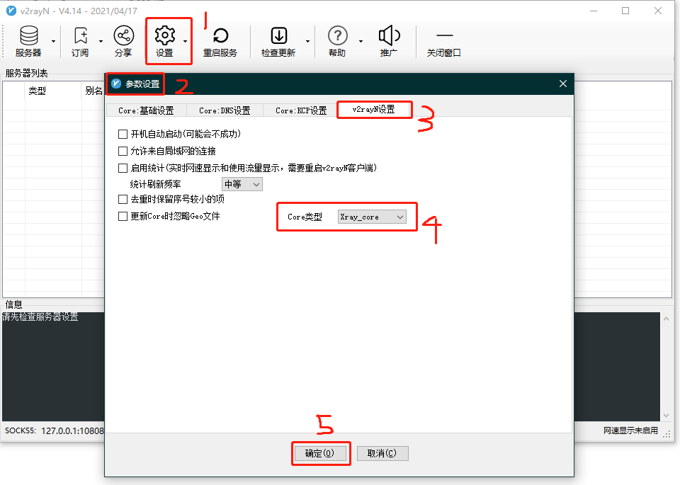

## Backgrounds

+ 内核：[Xray-core](https://github.com/XTLS/Xray-core)
+ 协议：VLESS + TCP + XTLS（仅有 Xray 内核支持）
+ VPS 物理地址：JP - Equinix Osaka SoftBank
+ VPS 规格：
  + CPU: 1x Intel Xeon
  + RAM: 1 GB
  + SSD: 20 GB RAID-10
  + Transfer: 500 GB/mo
  + Link speed: 1 Gigabit
  + OS: Debian Buster
  + Support China Telecom CN2 GIA
  + Enterprise level transport for China Unicom provided by China Telecom

## QR Code (Important)

> 暂时还没有
> 
> ......
> 
> ......

## Getting Started

### Windows

#### 客户端：v2rayN

**4.14 版本**下载：[v2rayN-4.14.zip](https://github.com/2dust/v2rayN/releases/download/4.14/v2rayN-Core.zip)

官方 release 仓库：https://github.com/2dust/v2rayN/releases

#### 使用方式

1. 解压压缩包，打开 **`v2rayN.exe`** ，点击桌面右下角的图标打开

2. "设置" -> "参数设置" -> "v2rayN 设置" -> "Core类型改为Xray_Core" -> "确认"
3. "服务器" -> “扫描屏幕上的二维码”
4. (可选) 右键点击「服务器列表」中新添加的条目 -> "测试服务器延迟Ping"，查看是否可以 Ping 通
5. 右键点击「服务器列表」中的条目 -> "设为活动服务器"
6. "设置" -> "路由设置" -> "基础功能" -> "一键导入基础规则" -> "确认"
7. 右键点击桌面右下角的图标 -> "系统代理" -> "自动配置系统代理"，开始使用

#### 

### Android

#### 客户端：v2rayNG

**1.5.16版本**下载：[v2rayNG_1.5.16_arm64-v8a.apk](https://github.com/2dust/v2rayNG/releases/download/1.5.16/v2rayNG_1.5.16_arm64-v8a.apk) 或者 Google Play 中搜索 **v2rayNG**

官方 release 仓库：https://github.com/2dust/v2rayNG/releases

#### 使用方式

1. 打开 `v2rayNG` 程序
2. 点击右上角的 "+" 号 -> "扫描二维码"
3. 点击右下角的 "V" 键，开始使用

### IOS

#### 客户端：ShadowRocket

需要**美区 App Store 账号**，注意 ShadowRokcet 的版本需要 >= 2.1.68 (1162)，之前安装的版本不一定支持

*TODO：提供长久可靠的美服共享账号*

#### 使用方式

*TODO：待完成，应该也可以扫描二维码*

### macOS

*TODO：Qv2ray 或者 v2rayN*

### 软路由

*TODO：OpenWrt + HelloWorld 插件*

## BenchMark

+ VPS 双向流量上限为 500GB/月，带宽上限为 1Gbps，和市面主流梯子对比，大致可以满足 5 人的中度使用或 10 人的轻度使用需求，且不限制设备数量
+ 简单的测试：
  + 节假日（5月4日）晚高峰时间，可以轻松跑满上海电信 200Mbps 带宽，CPU 使用率为 40%，受限于物理带宽，暂时无法测试更高的带宽并发量
  + 节假日（5月4日）晚高峰时间，观看 [youtube 4K 60FPS 视频](https://www.youtube.com/watch?v=zCLOJ9j1k2Y&t=74s)，缓冲速度峰值达到 210Mbps，基本可以稳定在 150Mbps，播放流畅；8K 60FPS 视频受限于客户端 CPU 性能（视频解码 + 流量加解密），可能会造成电脑卡死，最好使用专门的软路由
  + 节假日（5月4日）晚高峰时间，在上海电信网络 ping 主机域名，平均延迟在 40ms 左右，未出现丢包现象，连接稳定
+ 未来可能存在的瓶颈：服务端 CPU 性能较弱，考虑升级到双核

